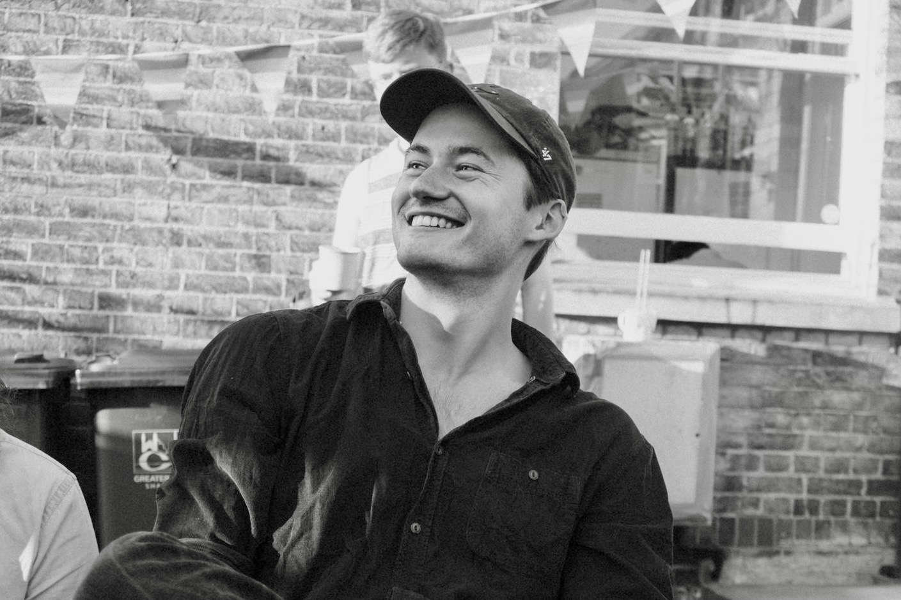

# Aleksandr Bowkis
Aleksandr Bowkis is a PhD candidate in Cosmology at the Institute of Astronomy, University of Cambridge. His research is focussed on the reconstructed CMB lensing bispectrum.

### Education
- MMath, Distinction, University of Cambridge 2019
- BA, Natural Sciences, University of Cambridge 2018

### Publications

Kalaja A., Orlando G., Bowkis A., Challinor A., Meerburg D., Namikawa T. The reconstructed CMB lensing bispectrum (2023). [Publication](https://inspirehep.net/literature/2173138)

Calculated for the first time the leading-order noise-biases in the reconstructed CMB lensing bispectrum, a non-Gaussian statistic providing insight into non-linear growth of large scale structure in the universe. Verifyied analytic predictions with paired simulations, isolating individual biases.

